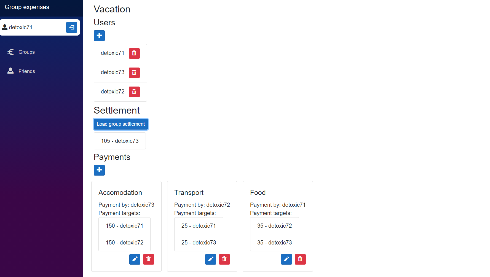

# Group expenses

## Introduction
The app is created with the aim to solve common problem when travelling in group and that is to calculate the expenses among its members and settle the depths created within the group. 

## Architecture

Application consists of 2 independently functional parts: backend build on ASP.NET core and frontend build on Blazor WebAssembly.

There is also Entities project, which groups common data structures across the BE and FE (DTOs).

### Backend
The backend is build on top of ASP.NET as API controllers. There are 3 contollers / main routes (auth, group, user)
Custom exception middleware is used, which will handle thrown exceptions and is used as flow controll (together with checks) in API routes. Custom `HttpStatusException` is used to add error status code in the HTTP request (if exception thrown is not `HttpStatusException`, then status code 500 is used instead). PostgreSQL is used as the database provider, however any EF Core supported database can be used after (possibly none/slight) modification.
JWT token authorization is used and authorized routes are stateless, consuming only the data from request (including the token), making the application effectively stateless. Currently, there is just a single user role used, however admin user role is ready for future extension. 

Helpers are also used to separate repeating or important code.


### Frontend
Frontend is build as Blazor WebAssembly.
It highly uses component structure, with the aim to minimize code duplication.
Custom auth route handler has been build, which allows pages to be for authorized users only.
This is achieved by using `@attribute [Authorize]`. Futher improvement is possible by utilizing user roles on the frontend side, disabling the user to use for example admin .
API services are used, which serve as both data stores and data getters. They also have OnChange event subscriber,
which enables changes subscription. Also *provider* alternatives are provided, which exposes data as cascading paramether
for seamless data pass with automatic OnChange update.

Needless to say, the frontend works only with this backend.


## Installation

### Backend

Firstly, BE needs `appsettings.json` file to set variables. This file should be put in the root of WebApplication folder. Expected shape of the file is 
```{json}
{
    "ConnectionStrings": {
        "PostgreSql": "connection_string_here"
    },
    "Logging": {
        "LogLevel": {
            "Default": "Information",
            "Microsoft": "Warning",
            "Microsoft.Hosting.Lifetime": "Information"
        }
    },
    "AllowedHosts": "*",
    "JWT": {
        "Secret": "your_secret_here"
    }
}

```
Then Nuget package restore is needed. Then it can be run/build/published normally as any other ASP.NET application. 

By modifying `launchSettings.json` you can adjust the port, on which the application is running. 
### Frontend

Only requirement for running frontend is doing Nuget package restore. Application can be run, debugged or published. Using `dotnet publish --configuration Release` for publishing for public access
is recommended, because of IL trimming, which can reduce the size of the bundle. Content is placed under `wwwroot` folder and is suitable for static file hosting with single page 
application settings. Please note, that when published, by default the files produced are both compressed and uncompressed, potentionally saving network traffic of clients.

## Usage (user documentation)

Basic usage of the application can be divided into several parts.

First part consist of basic user managment. User can log in, register and logout. This is done via login/register forms, when the user is not logged in
and logout button, when the user is logged in. This can be further improved by adding user account managment, with the possibility of password/username change, etc.

Second part is the managing of user relationship with other users. User can send, reject and accept friend request. This module is prerequisite for the third module. When the user accepts the friend request, they become friends and this friend can be added to user group.

Third part is the user managment. Data are structured in 3 layers. First layer is `SinglePurposeUserGroup`. It is a group, which stands for singe event (vacation, ...),
which sets the lifetime boundaries of the group. This group is named, contain the group members and collection of underlying payment structure. Second layer is 
`UnidirectionalPaymentGroup`, which stands for a single payment reason (payment for the gasoline...). This group is also named, contains the person, who paid the transaction and  and the list of
payment targets (`SinglePayment`). From this setup, group settlement can be
calculated as the list of transactions, which when executed, people will not owe money to the other group members.




